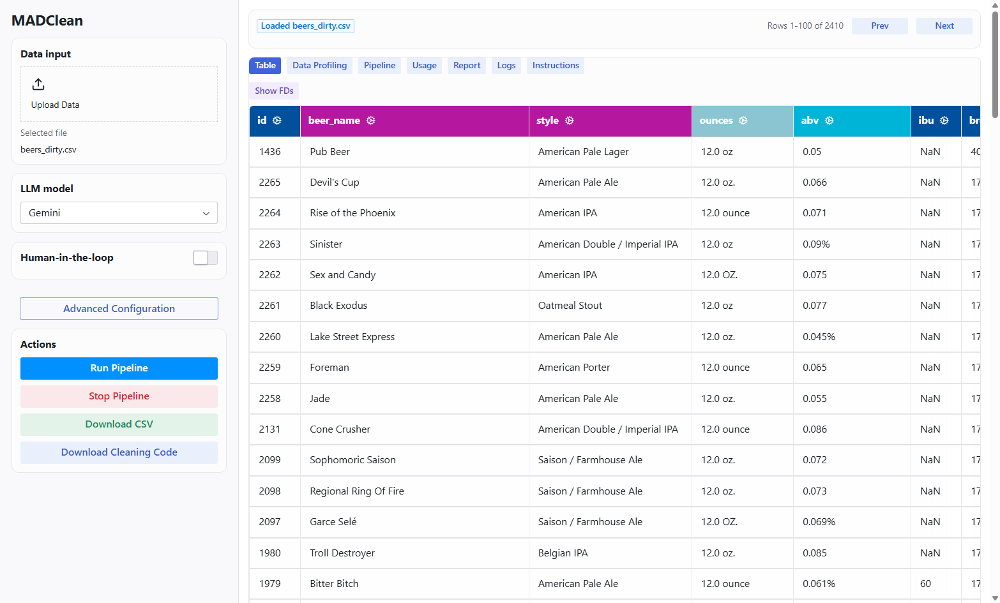

# MADClean — Multi-Agent Data Cleaning

MADClean is an automated tabular data cleaning framework that combines statistical data
profiling with the semantic reasoning and code generation abilities of large language models.
The profiler extracts column types, outliers and functional dependencies; a multi-agent LLM
loop (Recommender → Coder → Validator) turns those findings into executable cleaning code and
validates the result before it is applied.

```
madclean/          the framework: profiler, coordinator, multi-agent cleaner, LLM clients, scorer
evaluation/        the benchmark runner, baselines and their stored results
gui/               the Reflex web interface
tests/             the test suite
data/              the seven benchmark datasets, dirty and ground truth
docs/              screenshots used by this README
run                a shell script for setup, tests and re-scoring the stored results
```

## Requirements

- [uv](https://docs.astral.sh/uv/) for dependency management. It uses an installed Python 3.12,
  and downloads one if there is none.

Installation and the full test suite are tested on Windows and Linux.

## Installation

```bash
git clone https://github.com/williammgb/madclean-v2.git
cd madclean-v2
uv sync --frozen
```

This installs the locked dependency set from `uv.lock` into `.venv`, including the spaCy model
`en_core_web_sm`. Nothing else needs to be installed by hand. `./run setup` does the same from a
POSIX shell (on Windows, Git Bash).

Run the commands below with `uv run` in front (`uv run madclean ...`), or activate `.venv` first
and leave it off. `python -m madclean.main` works in place of `madclean` too.

<details>
<summary>Installing with pip instead</summary>

```bash
python -m venv .venv && .venv/Scripts/activate   # Windows; use bin/activate elsewhere
pip install -e .
```

Install it editable (`-e`), from the clone: the command line and the web interface read `gui/`,
`data/` and `configurations.json` from the repository folder.
</details>

## Configuring an LLM

Create a `.env` file in the repository root with the key for the provider you want to use:

```
GEMINI_API_KEY="your_api_key_here"
# or
OPENAI_API_KEY="your_api_key_here"
# or
OPENROUTER_API_KEY="your_api_key_here"
```

`.env` is git-ignored: keys never enter the repository. The default model is the
`LLM_CLIENT_NAME` entry in `madclean/llm/llm_settings.py`; every model MADClean knows about is
listed in `madclean/llm/llm_registry.py` and in `madclean --help`. The open-source models (Qwen,
Gemma) are reached through OpenRouter.

### Adding a provider

1. Add a client class in `madclean/llm/llm_clients.py`, following `BaseLLMClient`.
2. Register it in `madclean/llm/llm_registry.py` as an `LLMSpec` with its API key name.
3. Select it in the UI, with `--llm` on the command line, or as the new `LLM_CLIENT_NAME`.

## Cleaning from the command line

```bash
madclean DATASET [OPTIONS]
```

`DATASET` is a CSV, Excel or JSON file, or the name of a benchmark in `data/benchmark_datasets/`:
`hospital`, `beers`, `movies`, `rayyan`, `tax`, `adult` or `restaurants`. A benchmark is scored
against its ground truth after every run.

| Option | Effect |
| --- | --- |
| `--llm MODEL` | one model for all three agents |
| `--llm-recommender`, `--llm-coding`, `--llm-validation` | a model for one agent, overriding `--llm` |
| `--disable-validator` | skip the Validator agent: the Coder's output is applied unchecked |
| `--disable-fd` | skip cleaning with functional dependencies (rules between columns) |
| `--sample-size N` | the agents see N random and N dirty values per column (free-text columns keep their own sizes) |
| `--seed N` | the agents see the same samples on every run |
| `--config PATH` | a JSON settings file with the same keys as `configurations.json`, the default; flags override it |
| `--runs N` | clean N times; scores are printed per run and as a mean with its standard deviation |
| `--gt PATH` | a ground truth file to score each run against |
| `--mode paper\|strict` | the scoring mode (see [Evaluation](#evaluation)); default `paper` |
| `--save-cleaned` | write each cleaned table to `data/cleaned/` |
| `--results PATH` | write the settings, runtime, tokens and scores of every run to a JSON file |
| `--export-notebook PATH` | write the run as a notebook that reproduces it without a model |
| `-v`, `--verbose` | print profiling and per-agent progress |

Every setting the web interface offers is a key in the settings file: retries, validator sample
sizes, what to do when the Validator keeps failing, temperature, columns to skip. Settings that
wait for a person — human-in-the-loop review, the `USER` validator, `ask_user` — are switched off
on the command line, since nobody is there to answer.

The paper's experiments, as commands:

```bash
madclean beers --runs 4 --save-cleaned --results results/beers.json   # main results: mean of four runs
madclean hospital --llm Qwen_9B                                       # an open-source model for every agent
madclean rayyan --disable-validator                                   # ablation: no Validator
madclean hospital --disable-fd                                        # ablation: no functional dependencies
madclean movies --sample-size 64                                      # sensitivity to sample size
madclean my_data.csv --gt my_data_clean.csv                           # your own data, scored
```

The paper's fourth ablation, a basic prompt in place of the type-specific ones, is not an option:
its stored results are in `evaluation/results/ablation_study/`.

## Scoring a cleaned file

```bash
madclean evaluate CLEANED GROUND_TRUTH [--dirty PATH] [--mode paper|strict] [--results PATH]
```

Scores a cleaned file that already exists, from this tool or any other, without calling a model.
`GROUND_TRUTH` is a file or a benchmark name. Scoring needs the dirty file as well, to know which
cells were errors: it is found on its own for a benchmark and for `X_gt.csv` beside `X_dirty.csv`,
and is otherwise passed with `--dirty`.

```bash
madclean evaluate data/cleaned/beers_cleaned.csv beers
madclean evaluate out.csv truth.csv --dirty raw.csv --mode strict --results scores.json
```

## The web interface

```bash
madclean-ui
```

Reflex prints the URLs it serves on, normally a frontend on `http://localhost:3000/` and a
backend on `http://localhost:8000`. The first start downloads the web tooling Reflex needs, so it
takes a minute longer.

- **Upload data** — load a CSV or Excel file and preview the table.
- **Model selection** — pick an LLM per agent, or `USER` to validate by hand.
- **Advanced configuration** — cleaning and validation settings, sample sizes, human-in-the-loop.
- **Run pipeline** — live logs and progress, with step-level detail per column.
- **Usage and report** — tokens, runtime and the generated cleaning code.
- **Evaluation** — upload a ground-truth file with the same columns and row count to score a run.
- **Edit and download** — correct cells in the cleaned table and export the result.
- **Notebook export** — the run as an `.ipynb` that loads the dirty file, runs the code the agents
  wrote, and saves the cleaned table. It calls no model, so it runs anywhere and costs nothing.

The interface is eight views behind one workflow rail — Table, Profile, Pipeline, Review, Logs,
Report, Evaluation, Guide. Every browser tab gets its own run: two tabs can clean two datasets
without sharing a stop button or a review queue.



## Evaluation

`madclean/evaluation/` scores a cleaned dataset against its ground truth, and everything that
reports a number — the command line, the web interface and the benchmark scripts — goes through it.
It scores in two modes:

- **paper** — the comparison the paper used, so the committed results reproduce exactly: missing
  on both sides matches, the columns a benchmark declares numeric compare as numbers, everything
  else compares as it is.
- **strict** — the type has to agree as well. A column left as text where the ground truth holds
  numbers is counted wrong, which is invisible in paper mode.

`./run score` re-scores every stored MADClean run and every baseline in both modes and prints one
table, with the mean and the standard deviation over the runs of each dataset. It reads stored
files only: no model is called and no baseline is re-run.

## Security note

MADClean executes code written by a language model. It does **not** sandbox that code. Run it
only with models and in environments you trust.

## License

MIT — see [LICENSE](LICENSE).
